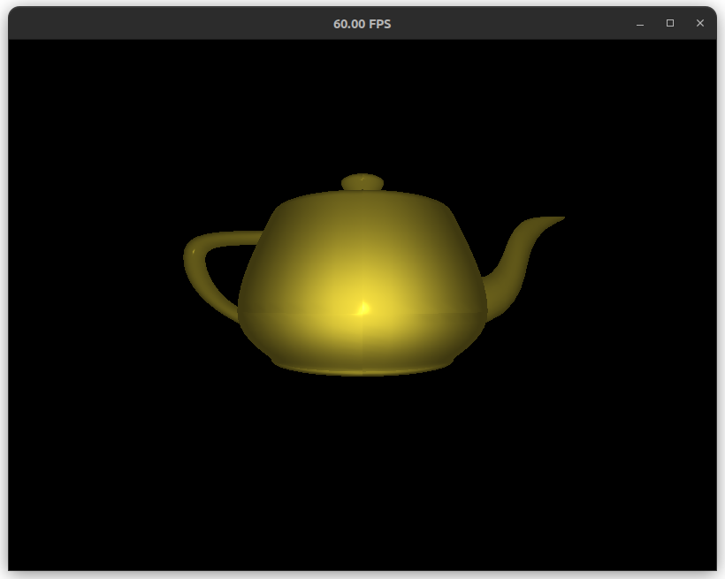

# Bloop: A Simple Software Renderer

A simple software renderer written in C. Provides programmable vertex, geometry, and pixel shaders.

A scene rendering the Utah teapot (with interpolated normals, hence the slight creasing in the model):

